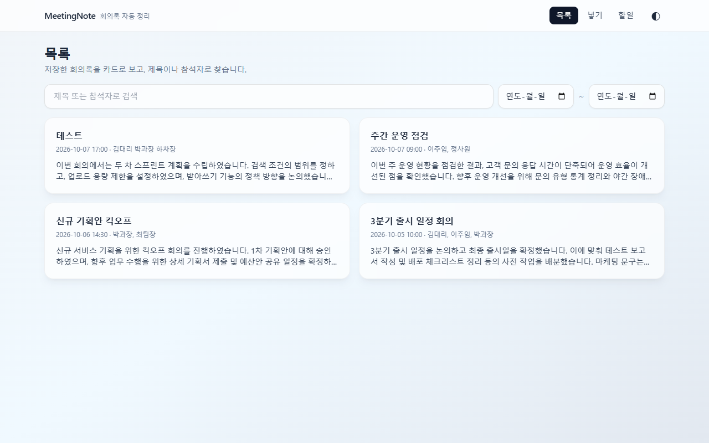
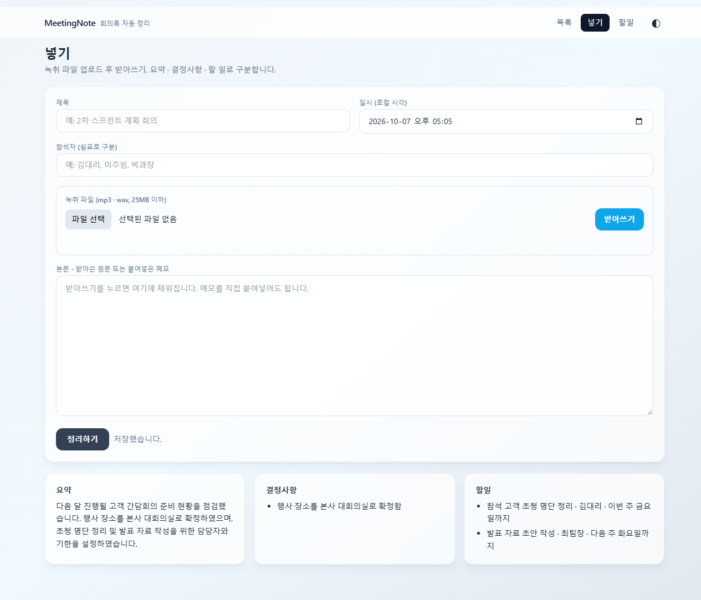
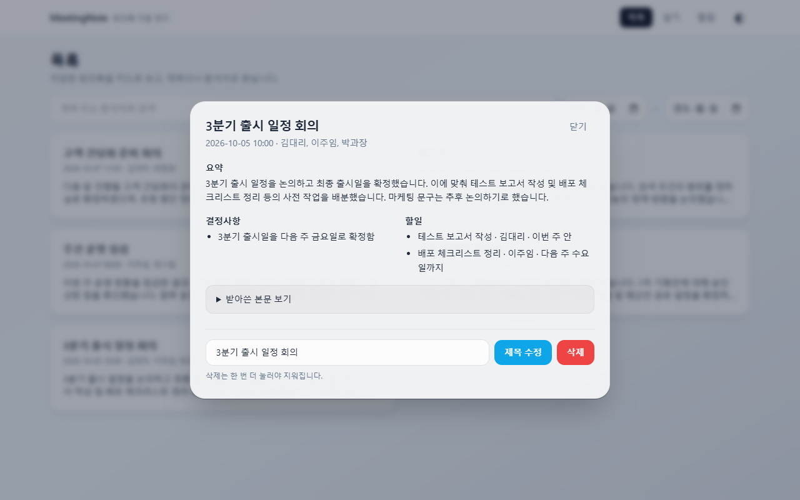
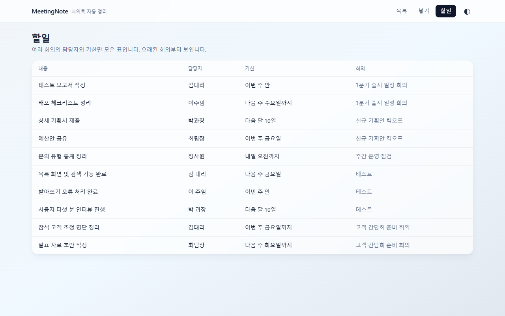
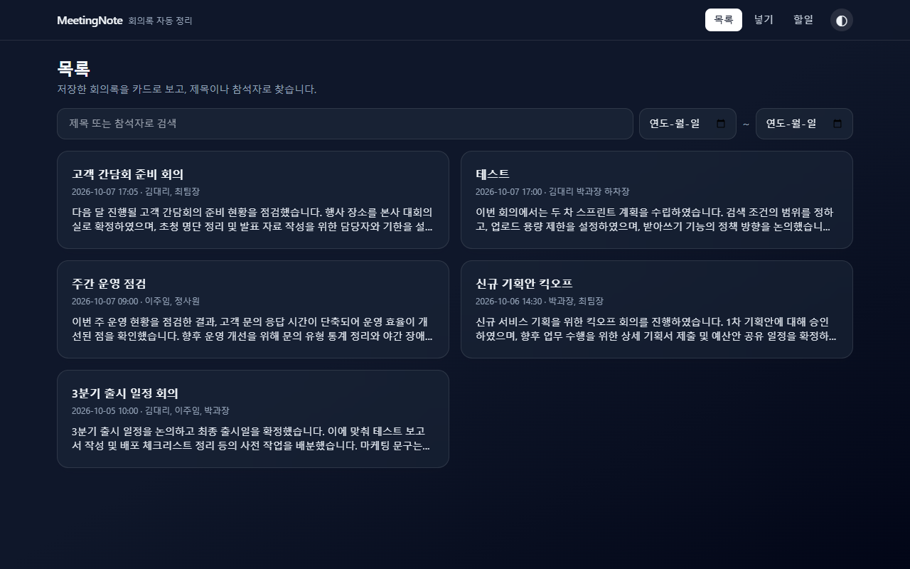
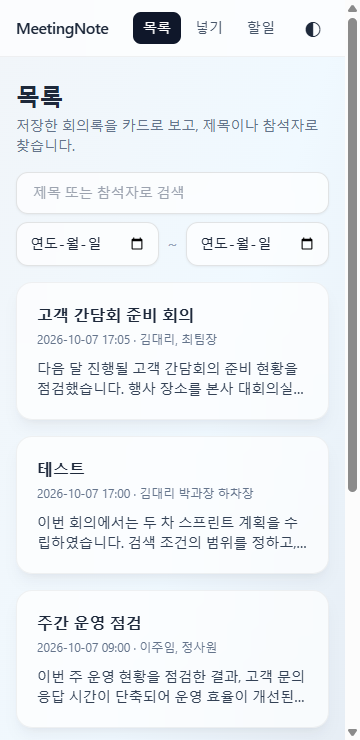

# MeetingNote

회의록 자동 정리 풀스택 웹 앱. 회의가 끝나면 정리가 끝나 있게 만들어서 "그때 뭐라고 했더라"를 없애는 것이 목표입니다.

녹취 파일(mp3, wav)을 올리거나 메모를 붙여넣으면 본문을 **요약 / 결정사항 / 할 일** 세 갈래로 나눠 저장하고, 목록 · 검색 · 할 일 모아 보기까지 한 화면 흐름으로 쓸 수 있습니다.

## 화면

| 목록 | 넣기 |
|---|---|
|  |  |

| 상세 | 할일 |
|---|---|
|  |  |

| 다크 테마 | 모바일 (360px) |
|---|---|
|  |  |

## 주요 기능

- 녹취 파일 업로드 (mp3, wav, 25MB 이하) 후 받아쓰기, 또는 메모 붙여넣기
- 본문을 요약 / 결정사항 / 할 일로 자동 구분 (할 일은 `내용 | 담당자 | 기한`)
- 회의록 추가 · 목록 · 수정(제목) · 삭제 (삭제는 두 번 눌러야 지워짐)
- 제목, 참석자, 날짜 범위로 검색
- 여러 회의의 할 일만 모아 보기 (담당자, 기한 표시)
- 라이트/다크 테마 토글 (선택은 `localStorage` 에 저장, 처음에는 시스템 설정을 따름)
- 모바일 반응형 (360px)

## 기술 스택

| 영역 | 사용 기술 |
|---|---|
| 백엔드 | FastAPI, Python 3.11 이상, SQLite (SQLAlchemy) |
| 프론트 | Vanilla JS + Tailwind CDN (`index.html`, `app.js` 2개 파일) |
| 받아쓰기·구분 | Gemini API (`gemini-3.1-flash-lite`) |
| 테스트 | pytest |

프론트는 백엔드가 같은 오리진에서 제공합니다. `index.html` 을 `file://` 로 직접 열면 동작하지 않습니다.

## 실행 방법

### 1. 준비

Python 3.11 이상이 필요합니다.

프로젝트 루트(`meetingnote/`)에 `.env` 파일을 만들고 Gemini API 키를 넣습니다. 이 파일은 저장소에 올라가지 않습니다.

```
GEMINI_API_KEY=여기에_키를_넣으세요
GEMINI_MODEL=gemini-3.1-flash-lite
```

### 2. 설치

```powershell
cd backend
python -m venv .venv
.venv\Scripts\activate
pip install -r requirements.txt
```

### 3. 서버 실행

```powershell
python -m app.main
```

브라우저에서 http://127.0.0.1:8000 을 엽니다. 포트는 8000 으로 고정입니다.

- 화면: http://127.0.0.1:8000
- API 문서(Swagger): http://127.0.0.1:8000/docs

처음 실행하면 `backend/meetingnote.db` (SQLite) 가 자동으로 만들어집니다.

## API

모든 경로는 `/api/` 로 시작합니다.

| 메서드 | 경로 | 성공 | 설명 |
|---|---|---|---|
| POST | /api/notes | 201 | 저장하며 세 갈래 구분까지 |
| GET | /api/notes | 200 | 목록 (`q`, `from`, `to`), 본문 제외 |
| GET | /api/notes/{id} | 200 | 단건 (본문 포함) |
| PUT | /api/notes/{id} | 200 | 수정 |
| DELETE | /api/notes/{id} | 204 | 삭제 |
| GET | /api/todos | 200 | 할 일 모아 보기 |
| POST | /api/upload | 200 | 녹취 파일을 본문 텍스트로 변환 |

오류 코드: 필수값 누락·형식 오류 400, 없는 id 404, 스펙 외 필드 422, mp3·wav 가 아닌 파일 415, 25MB 초과 413, 받아쓰기 외부 호출 실패 502.

구분(요약/결정사항/할 일)에 실패해도 회의록은 저장되고(201), 세 칸은 빈 값이 되며 화면에 "구분 실패"가 표시됩니다.

## 테스트

```powershell
cd backend
.venv\Scripts\python -m pytest
```

테스트는 **실제 Gemini 를 호출**합니다. `.env` 에 유효한 키가 있어야 하고, 호출 사이는 1초씩 띄웁니다. 실행 중 `httpx2` 설치 권고 경고가 나올 수 있으며 무시해도 됩니다.

## 폴더 구조

```
meetingnote/
├─ backend/
│  ├─ app/            FastAPI 앱 (main, models, schemas, gemini_service ...)
│  ├─ tests/          pytest 와 음성 샘플
│  └─ requirements.txt
├─ frontend/          index.html, app.js
├─ docs/              설계 문서 6종, 화면 구성 PDF, 스크린샷
├─ CLAUDE.md          작업 규칙
└─ swagger-test-report.md   Swagger 엔드포인트 테스트 보고서
```

## 문서

작업 전에 `docs/` 의 문서를 아래 순서로 읽습니다.

1. `00-overview.md` 개요
2. `01-product.md` 제품 정의
3. `02-specs.md` 기능 명세
4. `03-design.md` 설계
5. `04-tasks.md` 작업 목록
6. `05-conventions.md` 규칙

## 알려진 제한

- 날짜 필터(`from`, `to`)는 UTC 날짜 기준입니다. 한국 시간 새벽 회의는 전날로 걸릴 수 있습니다.
- 같은 본문이라도 Gemini 응답에 따라 구분 결과의 표현이 조금씩 달라집니다. 받아쓰기에서는 "김 대리"처럼 띄어쓰기가 참석자 표기와 다를 수 있습니다.
- Swagger 문서는 검증 실패를 422 로 표기하지만 실제 응답은 400 입니다. 자세한 내용은 `swagger-test-report.md` 를 참고하세요.
- 25MB 가 넘는 파일의 분할 업로드, 실시간 녹음, 화자 구분, 로그인, 팀 공유는 MVP 범위 밖입니다.
